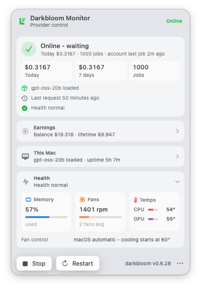
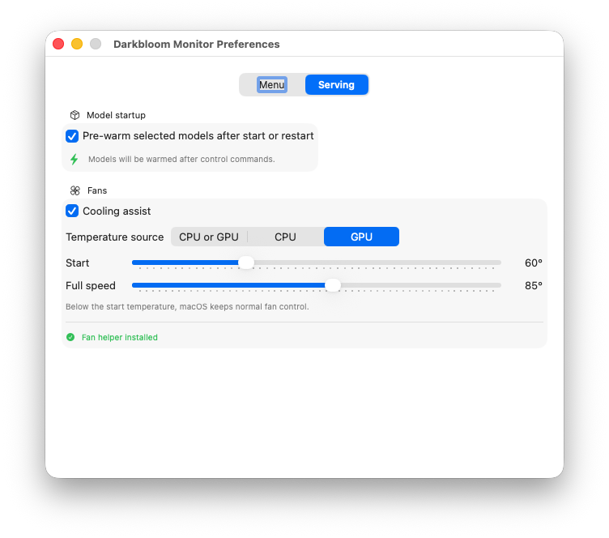

<div align="center">

# 🌑 Darkbloom Monitor

**Your Mac is earning. Now you can watch it.**

A native macOS menu bar app for [Darkbloom](https://www.darkbloom.dev)
providers — one glance tells you whether you're selling compute, one click
tells you everything else.

[](https://github.com/justin-schroeder/darkbloom-monitor/actions/workflows/ci.yml)
[](https://github.com/justin-schroeder/darkbloom-monitor/releases/latest)


<p>
  
  
</p>

</div>

## What you get

🟢 **The logomark in your menu bar** — green when your Mac is online and
earning, orange while connecting, red when stopped. That's the whole pitch.

Click it for the rest:

- 💰 **Earnings** — balance, today / 7 days / lifetime, and job counts,
  straight from the Darkbloom coordinator
- 🖥️ **This Mac** — the model being served, requests and tokens this
  session, GPU memory, uptime, and trust level
- 🌡️ **Hardware metrics** — memory use, fan speed, and CPU / GPU temperatures
- 📊 **Jobs chart** — paid inference jobs per hour over the last 24 hours
- 💻 **My Macs** — appears when more than one of your machines is online,
  with the models each is serving
- ⏯️ **Start / Stop / Restart** — control the provider without opening a
  terminal

## Install

1. Grab the `.dmg` from the [latest release](https://github.com/justin-schroeder/darkbloom-monitor/releases/latest)
2. Drag **Darkbloom Monitor** to Applications
3. Double-click it — the logomark appears in your menu bar

The app needs the [darkbloom CLI](https://github.com/Layr-Labs/d-inference)
installed and logged in (`darkbloom login`). It reuses the CLI's credentials
and state — there is nothing else to configure. To launch at login:
System Settings → General → Login Items.

> [!NOTE]
> Unsigned builds need a right-click → Open on first launch (or
> `xattr -d com.apple.quarantine "/Applications/Darkbloom Monitor.app"`).
> Releases are Developer ID signed and notarized when the signing secrets
> are configured — see [Releasing](#releasing).

## How it works

No private APIs, no extra auth, no daemon of its own — the app reads exactly
the same data the CLI does:

| Data | Source | Cadence |
|------|--------|---------|
| Provider status | `~/.darkbloom/daemon-state.json` + pid liveness probe — the same staleness rule `darkbloom status` uses | every 3s |
| Earnings & balance | `GET api.darkbloom.dev/v1/provider/account-earnings`, authenticated with the CLI's device token | every 30s |
| Fleet | public `GET /v1/providers/attestation`, filtered to machines verifiably yours | every 30s |
| Start / Stop / Restart | shells out to the `darkbloom` CLI, which drives the `io.darkbloom.provider` LaunchAgent | on click |

Measured footprint: 0.0% CPU, power impact 0.0 — the provider it watches
does real GPU work; the monitor is a rounding error.

A few hard-won details live in [AGENTS.md](AGENTS.md), including why
machines are identified by hardware serial (both `provider_id` and
`provider_key` rotate every restart) and why the app replays `--model`
flags from the LaunchAgent plist when starting.

## Development

```sh
swift test                  # the test suite
./scripts/build-app.sh      # release build → dist/Darkbloom Monitor.app
./scripts/make-dmg.sh       # package the .dmg
```

Plain SwiftPM — no Xcode project, no dependencies. `DarkbloomCore` holds
everything testable (decoding, earnings math, fleet logic); the executable
target is a thin SwiftUI shell. Commits follow
[Conventional Commits](https://www.conventionalcommits.org), which is what
builds the release changelogs.

## Releasing

```sh
./scripts/release.sh patch   # or minor / major / an explicit 1.2.3
```

That runs the tests, bumps the version, tags `vX.Y.Z`, and pushes. GitHub
Actions does the rest: build → sign → notarize → package `.dmg` → publish a
GitHub Release with a changelog generated from the conventional commits
since the previous tag.

For Developer ID signing and notarization, set these repository secrets
(otherwise releases fall back to ad-hoc signing and say so in the notes):

| Secret | Contents |
|--------|----------|
| `MACOS_CERTIFICATE_P12` | base64 of a Developer ID Application `.p12` export |
| `MACOS_CERTIFICATE_PASSWORD` | the `.p12` password |
| `NOTARY_APPLE_ID` | Apple ID email for notarization |
| `NOTARY_TEAM_ID` | 10-character team id |
| `NOTARY_PASSWORD` | app-specific password for `notarytool` |

---

<div align="center">
<sub>Unofficial. Not affiliated with Darkbloom or Layr Labs — just a happy provider who wanted a green dot.</sub>
</div>
